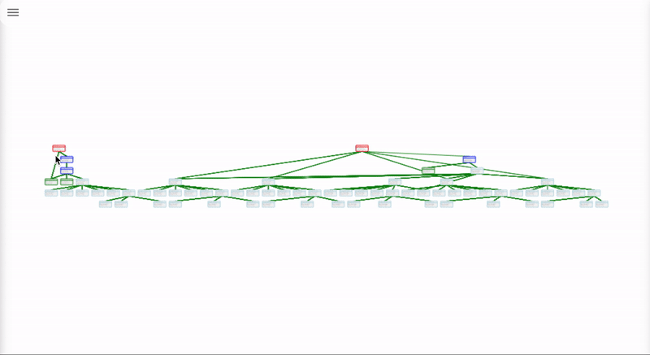

Visualize the dependency graph, identify over-rendering and performance bottlenecks, and debug the entire flow of data from actions to state to selectors to components.

# Installation

```
yarn add redux-visualize-tools
```

# Getting Started

First, add a button that will launch the dev-tools. Launching can also be done programmatically.

```javascript
import { windowManager } from "redux-visualize-tools";

// Create a button that launches the tools in bottom-right of the screen
windowManager.appendIcon(() => {
  // dev-tool window will relaunch after every update to the app until you close the window
  windowManager.autoReloadDevToolsUntilClosed();
});
```

Second, enhance the redux store. This unlocks functionality like viewing actions and time travel debugging.

```javascript
import { graph } from "redux-visualize-tools";
import reducer from "./reducer";
import { createStore } from "redux";

export const store = graph.enhance(createStore)(reducer);
```

Finally add nodes to the dependency graph by enhancing functions, react components, reselect selectors, and react-redux connected components.

```javascript
import React from "react";
import { connect } from "react-redux";
import { createSelector } from "reselect";
import { graph } from "redux-visualize-tools";

const MyComponent = ({ text }) => <div>{text}</div>;

const getText = state => state.text;

const getDoubledText = graph.add(createSelector)(
  [getText],
  text => text + text
);

const mapState = state => ({
  text: getDoubledText(state)
});

export default graph.add(connect)(mapState, null)(MyComponent);
```

# Only Use in Development

The problem with the above code is that it is importing the library in production which will result in a large bundle. To avoid this, we need to set up a file that that only exports the dev-tool in production.

```
/* Use this code if in development */

import { graph, windowManager } from redux-visualize-tools;
windowManager.appendIcon(() => {
  windowManager.autoReloadDevToolsUntilClosed();
});
export { graph };

/* Use this code in production */

// A No-op version of the library
export const graph = {
  add: f => f,
  enhance: f => f,
};
```

This requires manually editing this file before you make a build which isn't ideal. This can also be achieved automatically with a build script, a conditional import, or, in the future, a chrome extension.
